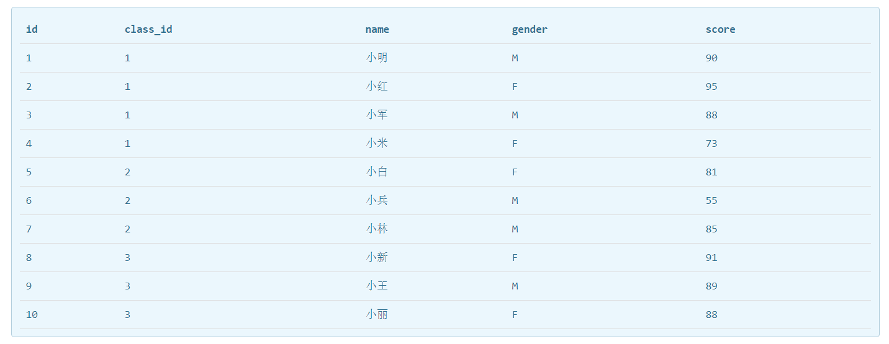
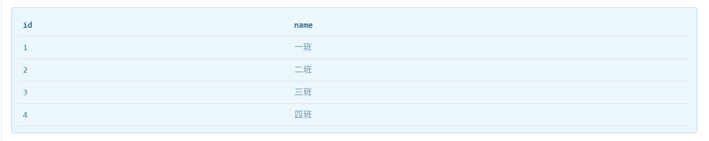

# sql

总结来自廖雪峰老师网站

## sqlite特点（关系数据库）

1.两个表有一对多关系时，需要采用到外键，比如会话表和消息表

2.两个表之间有多对多关系时，需要采用到中间表，比如老师表和班级表

3.如果表中数据太多时，可以将大表拆分为多个两个表，一个经常查询的表，一个不常查询的表，提供了查询速度

4.创建索引可以提高查询效率，但是会降低插入/更新/删除的效率

5.该列的值是否散列决定索引的效率


## 案例

students表



class表




### 查询(select .. from)

```sql
1.查students表
select * from students

2.查class表
select * from class

3.查出分数在80分以下或者90分以上，并且是男生的数据
select * from students where (score <= 80 or score >= 90) and gender = 'M'

4.查出students表中id、score、name这三列，并将score列该名为point的数据
slect id,score point,name from students

5.查出students表中班级为一班的，按score倒叙排列的数据，如果分数相同，按性别来排列的数据
//这种情况下where要放在order by前面
select * from students where class_id = 1 order by score desc,gender

6.分页查出students表中按score倒叙排列，每列3项数据，且是第一页
select * from students order by score limit 3 offset 0
select * from students order by score limit 3 offset 3 (第二页)
select * from students order by score limit 3 offset 6 (第三页)

7.查询students表一共有多少条记录
select count(*) num from students (把count(*) 改成了num)

8.每页3条记录，获取students表中的总页数
//把ceiling(cout(*)/3)改成pageSize可读性强一点
select ceiling(cout(*)/3) pageSize from students 

9.获取每个班级的学生数量
select count(*) num from students group by class_id

10.查询一班男生平均分数数据
select AVG(score) from students where class_id = 1 and gender = 'M'

11.查询一班所有学生的成绩总分
select SUM(score) from students where class_id = 1 

12.查询一班学生中成绩最高分
select MAX(score) from students where class_id = 1

13.查询一班学生中成绩最低分
select MIN(score) from students where class_id = 1

14.查询students和class两个表中的所有数据
select * from students,class

15.防止列名冲突设置别名
select s.id sid,s.name,s.gender,s.score,c.id cid,c.name cname from students s,class c where score >= 95 and c.id = 2

16.查出分数在90分以上的学生，并返回班级名称(inner join 内连接)
select s.id,s.name,s.gender,s.score,s.class_id from students s inner join class c on s.class_id = c.id where score >= 90

17.外连接，左外连接，右外连接，全外连接


```


### 插入(insert into)

```sql
1.往students表中插入一条数据
insert into students(class_id,name,gender,score) values (2,'小菜','M',100)

2.一次性添加多条数据
insert into students(class_id,name,gender,score) values (1,'小菜1','M',100),(2,'小菜2','M',100)

```


### 更新(update .. set)

```sql
1.更新students 表中 id=1的记录的名字和分数两个字段
update students set name = '小菜',score = 59 where id = 1

```


### 删除(delete from)

```sql
1.删除students 表中 id=1的记录
delete from students where id = 1
```

